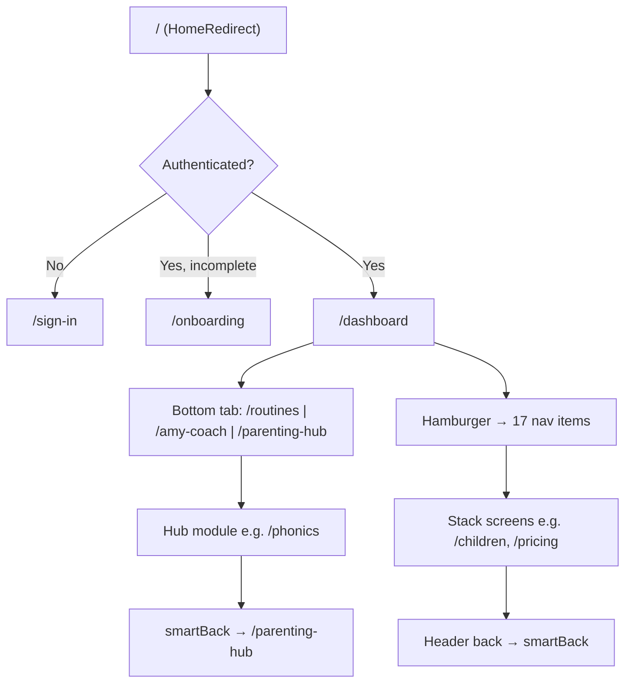

# AmyNest UI/UX Audit Report

**Audit date:** May 30, 2026  
**Auditor role:** Principal Mobile UX Engineer / Design Systems / Accessibility  
**Scope:** Full product — `artifacts/kidschedule/` (web SPA), Capacitor iOS shell, Play Store Android WebView (`android/`)  
**Platforms:** iOS, Android (WebView), tablets, foldables, small/large phones, desktop web  
**Method:** Static codebase audit + architecture review (no runtime device capture in this pass)

> **Platform note:** AmyNest ships as a **React + Vite SPA**, not React Native/Expo. iOS uses Capacitor; Android Play Store uses an immersive WebView loading production web. All findings below apply to this stack; HIG/Material guidance is mapped to web/CSS equivalents (`env(safe-area-inset-*)`, touch targets, focus rings).

---

## Executive Summary

AmyNest has **strong product architecture** — centralized chat keyboard (`ChatPlatform`), navigation stack with cycle detection, an aspirational `experience-system.ts`, and rich feature depth. However, **premium brand perception is undermined by systemic inconsistencies** rather than any single broken screen.

### Top 5 subconscious damage points

| # | Issue | Impact |
|---|--------|--------|
| 1 | **Production Android has no safe-area inset bridge** while using immersive edge-to-edge + hidden system bars | Content/CTAs collide with gesture nav and status cutouts on Pixel/Samsung |
| 2 | **Bottom tab bar only visible on `/dashboard`** — tab roots (`/routines`, `/amy-coach`, `/parenting-hub`) lose primary navigation affordance | Users feel lost after first navigation; breaks Material/iOS tab bar mental model |
| 3 | **Design tokens exist but are ignored** — 150+ files use `text-[8–15px]`, triple color systems, shadcn vs product radius split | Screens feel like different apps stitched together |
| 4 | **Default touch targets are 32–36px** (shadcn `Button`) across the entire app | Violates 44pt/48dp guidelines on icon buttons, chips, carousel controls |
| 5 | **`experience-system.ts` adopted by ~6 files** while 80+ screens roll custom spacing/motion | Learning surfaces feel premium; hub/dashboard/routines feel ad-hoc |

### Overall scores (estimated)

| Dimension | Score | Grade |
|-----------|-------|-------|
| Design system consistency | 52/100 | D+ |
| Safe area / edge-to-edge | 38/100 | F (Android Play critical) |
| Responsive layout | 64/100 | C |
| Navigation UX | 71/100 | C+ |
| Keyboard UX (chat/auth) | 82/100 | B |
| Touch targets | 45/100 | D |
| Accessibility | 58/100 | D+ |
| Performance UX | 70/100 | C+ |
| Premium brand cohesion | 60/100 | C |

---

## Phase 1 — Global Design System Audit

### Typography

**Canonical sources**
- `artifacts/kidschedule/src/index.css` — Nunito body, Quicksand headings (`h1–h6`)
- `artifacts/kidschedule/src/lib/experience-system.ts` — `TYPE` scale (pageTitle, sectionTitle, body, micro, pill)
- Tailwind defaults — no custom `@theme` font-size tokens

**Findings**

| Severity | Issue | Files / evidence |
|----------|-------|------------------|
| **High** | Micro typography band outside scale: `text-[8px]` through `text-[15px]` in 100+ files | `social-landing.tsx`, `parenting-hub.tsx`, `mobile-tab-bar.tsx`, `dashboard.tsx`, `infant-hub.tsx`, `spelling-mastery.tsx` |
| **High** | `TYPE` tokens defined but **~6 consumers** vs 150+ arbitrary sizes | `experience-system.ts` vs grep across `pages/` and `components/` |
| **Medium** | Dual display fonts without unified token — `font-quicksand` used widely but not in `@theme` | `index.css`, 100+ component files |
| **Medium** | Inter loaded in `index.html` but never used | `artifacts/kidschedule/index.html` L86 |
| **Medium** | Inline `fontSize` in style props bypasses scale | `onboarding.tsx`, `AmySuggestionPanel.tsx`, `printable-worksheets.tsx` |
| **Low** | Heading sizes inconsistent per screen — `text-2xl` vs `text-3xl` vs `text-lg` for same hierarchy | `amy-learning-tutor.tsx`, `assistant.tsx`, `parenting-hub.tsx` |

**Screenshot references (manual QA)**
- Tab bar labels at 10–11px on 320px width — `mobile-tab-bar.tsx`
- Hub tile subtitles at 9–10px — `parenting-hub.tsx`
- Landing marketing microcopy — `landing.tsx`, `social-landing.tsx`

### Spacing

| Severity | Issue | Files |
|----------|-------|-------|
| **High** | Hardcoded scroll reserves `80px` / `120px` ignore safe areas | `index.css` `.app-scroll`, `.scroll-safe` |
| **Medium** | `SCREEN_SPACING` in `experience-system.ts` barely used | Most pages use inline `px-4`, `gap-2`, `py-3` |
| **Medium** | Magic horizontal inset `12px` mixed with Tailwind `px-4` (16px) | `.amynest-page-inset`, `dashboard-inline-inset` |
| **Low** | Subtitle indent `ml-[18px]` one-off | `dashboard-section-header.tsx` |

### Color System

| Severity | Issue | Files |
|----------|-------|-------|
| **Critical** | **Triple background values** — `#0b1020` body, `#0b0b0b` `--bg-primary`, HSL `--background` | `index.css` |
| **High** | `--accent` name collision — blue hex vs teal HSL semantic | `index.css` L272 vs L327 |
| **High** | Dark-only product ships duplicate light/dark CSS blocks with no divergence | `index.css` `:root` vs `.dark` |
| **Medium** | Feature code bypasses tokens — raw Tailwind palette (`amber-400`, `indigo-500`) | `parenting-hub.tsx`, `speech-game-theme.ts` |
| **Medium** | Inline hex/rgba in marketing and onboarding | `onboarding.tsx`, `social-landing.tsx`, `pricing-plan-card-ui.ts` |
| **Low** | `text-muted-foreground` used 1,800+ times — contrast varies by surface | App-wide |

### Border Radius

| Severity | Issue | Pattern |
|----------|-------|---------|
| **Medium** | shadcn primitives use `rounded-md` (~6px effective); product UI uses `rounded-2xl`/`rounded-3xl` | `button.tsx`, `input.tsx` vs chat bubbles, hub cards |
| **Low** | One-offs: `rounded-t-[10px]`, `rounded-[2rem]` | `drawer.tsx`, `social-landing.tsx` |

### Shadows / Elevation

| Severity | Issue | Pattern |
|----------|-------|---------|
| **Medium** | Token shadows are flat bottom-offset (game-kit style); features use diffuse glow shadows | `index.css` `--shadow-*` vs `parenting-hub.tsx`, `pricing-plan-card-ui.ts` |
| **Low** | `.hover-elevate` pseudo-element system coexists with Tailwind `shadow-lg` | `index.css`, `dialog.tsx` |

### Icons

| Severity | Issue | Sizes found |
|----------|-------|-------------|
| **Medium** | No central icon size token — 16/20/24/28/40px chosen per context | shadcn `size-4`, tab bar `h-5`, center tab `h-7` |
| **Low** | Emoji used as icons with inline fontSize | `onboarding.tsx` |

---

## Phase 2 — Safe Area Audit

### Implementation map

| Layer | Safe area handling | Status |
|-------|-------------------|--------|
| Capacitor iOS | `StatusBar.setOverlaysWebView(false)` + `env(safe-area-inset-top)` on header | ✅ Good |
| Play Store Android | Immersive + hidden system bars; **keyboard inset only** | ❌ Critical gap |
| CSS utilities | `.pt-safe`, `.pb-safe`, `--sab` | ⚠️ `--sab` stays `0` on Play Android |
| PWA standalone | No dedicated safe-area block | ⚠️ Medium |

### Critical violations

| Screen / component | Issue | File |
|--------------------|-------|------|
| **All authenticated screens (Android Play)** | No `--sab` / nav inset injection; header `padding-top: 0` | `android/.../MainActivity.kt`, `index.css` ~826–834 |
| **Dashboard + tab bar** | Fixed 72px footer, `padding-bottom: 0` on Android shell | `mobile-tab-bar.tsx`, `index.css` ~895–909 |
| **Auth flows** | `env(safe-area-inset-*)` unreliable in immersive WebView; bottom safe area skipped | `auth-keyboard-shell.tsx`, `sign-in.tsx`, `index.css` |
| **Social landing CTA** | `fixed bottom-0`, `py-3` only | `social-landing.tsx` ~793 |
| **Paywall modal header** | `sticky top-0`, no top inset | `paywall-modal.tsx` |
| **Bottom sheets / drawer** | No bottom safe padding | `drawer.tsx`, `sheet.tsx` |
| **Toast (mobile)** | `fixed top-0` — may overlap Dynamic Island | `toast.tsx` |
| **Phonics bottom controls** | Fixed bar, no bottom inset | `phonics.tsx` ~249 |
| **Games sticky header** | No safe top; inline `paddingBottom: 80` | `games.tsx` |
| **Nutrition / articles** | Sticky headers without safe top | `nutrition/index.tsx`, `parenting-articles.tsx` |
| **Hub empty states** | Main path has safe top; empty state uses `py-3` only | `hub-module-page-shell.tsx` ~93 |
| **Phonics no-child state** | Same inconsistency | `phonics.tsx` ~97 |

### Device matrix (expected failures without fix)

| Device class | Expected failure |
|--------------|------------------|
| iPhone 14/15 Pro (Dynamic Island) | Toast overlap; immersive headers OK on iOS Capacitor |
| iPhone SE / notch | Auth CTA near home indicator on Android WebView |
| Pixel 7+ gesture nav | Tab bar + fixed CTAs under gesture pill |
| Samsung One UI | Same + immersive status bar content clip |
| iPad / tablet | Desktop sidebar shows; mobile tab hidden — OK; some hub grids fixed-width |
| Foldable (narrow cover) | 320px micro text + horizontal scroll on hub/dashboard |

---

## Phase 3 — Edge-to-Edge Audit (Android 13–15)

### Shipped wrapper: `android/app/src/main/kotlin/com/amynest/app/MainActivity.kt`

```kotlin
WindowCompat.setDecorFitsSystemWindows(window, false)
controller.hide(WindowInsetsCompat.Type.systemBars())
// applyWebSafeAreaInsets — keyboard only, no status/nav insets
```

### Violations

| ID | Violation | Severity |
|----|-----------|----------|
| E2E-01 | Immersive mode without CSS inset bridge | **Critical** |
| E2E-02 | Dead code path: `kidschedule-android/` injects `--sab` but is **not shipped** | **Critical** (fix landed wrong tree) |
| E2E-03 | `__amynestApplyShellInsets` referenced in alt MainActivity, no JS handler | **High** |
| E2E-04 | `--sat`, `--sal`, `--sar` defined in CSS, never written | **Medium** |
| E2E-05 | `.header-safe` utility defined, zero component usage | **Low** |
| E2E-06 | `.inset-bottom-safe` class sets `padding-bottom: 0` | **High** (misleading name) |
| E2E-07 | Chat messages padding uses JS height only — no safe-area term on Android Play | **Medium** |

**Reference implementation (good):** `subscription-pricing-sticky-cta.tsx` — `pb-[max(0.75rem,env(safe-area-inset-bottom))]`

---

## Phase 4 — Responsive Layout Audit

Simulated breakpoints: **320, 360, 375, 390, 412, 430, 768, 1024** px.

### Global patterns

| Pattern | Count (approx.) | Risk |
|---------|-----------------|------|
| `text-[8–11px]` labels | 100+ files | Clipping at 320px |
| `min-w-[` / fixed widths | 40+ files | Overflow |
| `overflow-x-auto` | dashboard, routines, hub, admin | Horizontal scroll by design — verify intent |
| Hardcoded heights (`h-[52px]`, `h-[72px]`) | tab bar, composer, headers | Layout shift when font scales |

### Screen-specific findings

| Screen | Width risk | Issue | File |
|--------|------------|-------|------|
| **Parenting Hub** | 320–360 | Dense tile grid, 9px badges, multi-column overflow | `parenting-hub.tsx` |
| **Dashboard** | 320 | Phase-2 widgets, executive dashboard pills at 10px | `dashboard.tsx`, `family-executive-dashboard/` |
| **Routines index** | 360 | Week navigator + tabs; horizontal scroll | `routines/index.tsx` |
| **Routines detail** | 375 | Long routine titles, modal overlays | `routines/detail.tsx` |
| **Social landing** | 320 | Marketing hero, fixed bottom CTA | `social-landing.tsx` |
| **Onboarding** | 390 | Multi-step wizard, emoji sizing | `onboarding.tsx` |
| **Speech Coach** | 412 | Immersive layout, game flow | `speech-coach/index.tsx` |
| **Spelling mastery** | 320 | Dense word grid, 26 micro-text hits | `spelling-mastery.tsx` |
| **Infant hub** | 360 | 28 micro-text hits, tracker rows | `infant-hub.tsx` |
| **Admin dashboard** | 1024+ | Tables OK; mobile cramped | `admin-dashboard.tsx` |
| **Pricing** | 320 | Sticky CTA + plan cards | `pricing.tsx` |
| **AI Coach** | 375 | Voice-first layout, 13 micro-text hits | `ai-coach.tsx` |
| **Assistant** | 390 | Chat thread — generally fluid | `assistant.tsx` |
| **Abacus / math** | 768 | Animation canvas fixed aspect | `abacus-zone.tsx`, `math-animation/` |

### Foldable / tablet

- **Tablet (768+):** Desktop sidebar activates; bottom tab hidden — acceptable.
- **Foldable cover (320):** Hub and dashboard are highest clipping risk.
- **No `max-w-*` content constraint** on some immersive screens — lines too long on iPad landscape.

---

## Phase 5 — Navigation Audit

### Architecture

- **Router:** wouter in `AppCore.tsx`
- **Back:** `smartBack()` in `safe-navigation.ts` — history → parent route → stack → dashboard
- **Stack:** `navigation-stack.ts` — tab roots, hub modules, cycle detection (max depth 8)

### Flow diagram — primary mobile journey



### Findings

| Severity | Issue | Details |
|----------|-------|---------|
| **Critical** | **Tab bar only on `/dashboard`** | `layout.tsx` L158: `showDashboardChrome = location === "/dashboard"`. Users on tab-root routes lose bottom nav. |
| **High** | Tab navigation vs back stack confusion | Entering `/routines` via tab replaces; back from deep child may skip expected tab state |
| **High** | `/profile` redirects to `/parent-profile` | Alias OK; hamburger label says "Profile" |
| **Medium** | `/babysitters` redirects to `/dashboard` | Dead marketing link if referenced externally |
| **Medium** | Catch-all uses `route-failed.tsx`, not `not-found.tsx` | `not-found.tsx` imported but unused in `AppCore.tsx` |
| **Medium** | Immersive routes hide header — back relies on in-page controls | Speech coach, phonics, study — verify each has visible back |
| **Low** | `kids-control-center` badge "Soon 🚀" still navigable | `layout.tsx` NAV_ITEMS |
| **Low** | MAX_STACK = 8 may drop history on deep hub exploration | `navigation-stack.ts` |

### Back button behavior

| Context | Behavior | Risk |
|---------|----------|------|
| Layout header | `invokePageBackHandler()` then `smartBack` | ✅ Good pattern |
| Android hardware back | WebView default → history | ⚠️ No custom `MainActivity` back delegation audited |
| Tab roots (non-dashboard) | Back → dashboard via `smartBack` | ⚠️ Skips tab bar (hidden anyway) |
| Modal dismiss | Radix dialog/sheet | ✅ Focus trap via Radix |
| Paywall | Modal overlay | Back may not dismiss — verify |

### Deep links

| Route | Handler | File |
|-------|---------|------|
| `/referral/:code` | Standalone | `referral-deep-link.tsx` |
| `/app`, `/get-app` | Store landing | `store-tap.tsx`, `social-landing.tsx` |
| Auth callbacks | Multiple paths | `auth-callback.tsx`, `apple-auth-callback.tsx` |

---

## Phase 6 — Keyboard Audit

### Compliant zones (architecture ✅)

| Zone | Owner | Files |
|------|-------|-------|
| Chat / conversational UI | `ChatPlatform` | `chat-platform.tsx`, `use-keyboard-chat-layout.ts` |
| Auth forms | `AuthKeyboardShell` | `auth-keyboard-shell.tsx`, `use-native-auth-keyboard.ts` |
| Android IME | Native bridge | `MainActivity.kt` → `--auth-keyboard-inset-native` |

**Screens using ChatPlatform (via ChatThread):** onboarding, assistant, amy-ai-tutor, amy-learning-tutor

### Gaps

| Screen | Issue | Severity | File |
|--------|-------|----------|------|
| **Sign-in / sign-up / reset** | Bottom safe area skipped on Android shell during keyboard open | **High** | `index.css` auth scroll rules |
| **AI Coach** | Voice-first; text inputs use `focus:outline-none` only — not on ChatPlatform by design | **Medium** | `ai-coach.tsx` |
| **PTM prep, tiffin feedback** | Custom inputs `h-8`/`h-9`, no keyboard shell | **Medium** | `ptm-prep.tsx`, `tiffin-feedback-panel.tsx` |
| **Children form** | Photo picker + fields; no dedicated keyboard shell | **Medium** | `children/form.tsx` |
| **Routines generate** | Long form; scrollIntoView used | **Low** | `routines/generate.tsx` |
| **Parenting hub** | Inline inputs in modals | **Low** | `parenting-hub.tsx` |
| **Feedback / admin** | Standard inputs in Layout | **Low** | `feedback.tsx` |
| **Persistent composer send** | Fixed bottom bar — OK via ChatPlatform footer padding | ✅ | `persistent-composer.tsx` |

### ChatPlatform message area (Android Play)

Footer uses `pb-[calc(1rem+var(--sab,env(...)))]` ✅  
Messages use `paddingBottom: Math.max(inputBarHeight, 16) + 12` — **missing safe-area on Play Android** ⚠️

---

## Phase 7 — Touch Target Audit

**Standard:** 44×44 pt (iOS) / 48×48 dp (Android)

### Systemic violation

`components/ui/button.tsx`:
- `default`: `min-h-9` → **36px**
- `sm`: `min-h-8` → **32px**
- `icon`: `h-9 w-9` → **36×36px**

**All default shadcn buttons fail WCAG 2.5.5 target size** unless overridden.

### Notable violations

| Component | Size | Has label? | File |
|-----------|------|------------|------|
| Send button | 36×36 | ❌ | `persistent-composer.tsx` |
| Story carousel arrows | **28×28** | ✅ | `story-carousel.tsx` |
| Sidebar trigger | **28×28** | sr-only | `ui/sidebar.tsx` |
| Routine modal close | **32×32** | ❌ | `routines/detail.tsx` |
| Story player close | **32×32** | ✅ | `story-player.tsx` |
| Recipe edit/delete | **32×32** | ❌ | `recipes.tsx` |
| Week prev/next | 36×36 | ❌ | `routines/index.tsx` |
| Toast close | ~24×24 (`p-1`) | partial | `toast.tsx` |
| Back header button | **40×40** | ✅ | `layout.tsx` — close but still under 44 |
| Center Amy tab | 60×60 | ✅ | `mobile-tab-bar.tsx` |
| Abacus primary actions | 44px min | ✅ | `abacus-zone.tsx` — **only consistent exception** |

**Estimated violations:** 21 `size="icon"` buttons + 100+ `size="sm"` + 87 files with `h-8`/`w-8` patterns.

---

## Phase 8 — Accessibility Audit

### Coverage metrics (static)

| Signal | Count | Files |
|--------|-------|-------|
| `aria-label` | ~115 | 78 |
| `onClick` handlers | ~800+ | ~180 |
| `role=` | ~75 | ~50 |
| `sr-only` | 14 | 13 |
| `focus-visible` | ~35 | mostly `ui/*` |
| `` with meaningful `alt` | 18/22 | — |
| Decorative `alt=""` | 4 | verify context |

### Critical gaps

| Issue | Example files |
|-------|---------------|
| Icon-only buttons without names | `persistent-composer.tsx`, `routines/detail.tsx`, `recipes.tsx`, `event-prep.tsx` |
| Mislabeled nav | `mobile-tab-bar.tsx` — `aria-label={t("nav.dashboard")}` on entire `<nav>` |
| `div` + `onClick` without role/keyboard | `routines/detail.tsx` (7 backdrops), `games.tsx`, `daily-kids-activity.tsx` |
| Conflicting a11y | `fixed-activities-inline-card.tsx` — `sr-only` + `aria-hidden` on trigger |
| Focus removed without replacement | `amy-fab.tsx` — `focus:outline-none` |
| Small muted text contrast | `text-[10px]` + `text-muted-foreground` app-wide |

### Accessibility score: **58/100 (D+)**

| Criterion | Score |
|-----------|-------|
| Perceivable | 55 |
| Operable | 50 |
| Understandable | 65 |
| Robust | 60 |

**Recommended verification:** axe/Lighthouse on onboarding, assistant, routines detail, spelling-mastery, mobile tab bar; `pnpm run check:chat-platform`.

---

## Phase 9 — Performance UX Audit

### Strengths

- Route chunk preloading: `route-chunk-preload.ts`, `capacitor-route-preload.tsx`
- Performance tier system: `performance-tier.ts`, `visualBudget` in `experience-system.ts`
- Lazy `AppCore` behind splash in `App.tsx`
- Skeleton components in dashboard, family executive dashboard, audio lessons

### Issues

| Severity | Issue | File |
|----------|-------|------|
| **High** | Framer Motion on math animation stack — 17+ motion nodes per interaction | `math-animation/TryItInteractionLayer.tsx` |
| **Medium** | Dashboard loads 15+ skeleton/loading states — staggered pop-in | `dashboard.tsx` |
| **Medium** | No unified skeleton — mix of pulse divs, spinners, blank screens | App-wide |
| **Medium** | `experience-system.ts` page transitions defined but not applied globally | `pageEnter` variants unused in router |
| **Low** | Image loading — hero images without explicit dimensions in some marketing pages | `landing.tsx`, `social-landing.tsx` |
| **Low** | Debug panel / audio health overlay fixed position — dev-only | `debug-panel.tsx` |

### Loading state quality

| Tier | Screens |
|------|---------|
| **Good** | Family executive dashboard (`dashboard-states.tsx`), audio lessons skeleton, premium-polish loaders |
| **Adequate** | Dashboard widgets, routines index |
| **Weak** | Phonics no-child, hub empty states, admin tables ("No sessions yet" plain text) |
| **Missing** | Several hub modules jump from blank to content |

### Empty state quality

| Tier | Screens |
|------|---------|
| **Good** | `EmptyStateCard` in parent-growth, debug-learning, premium-polish |
| **Adequate** | Dashboard "No routine for today", parent-command-center |
| **Weak** | Admin dashboard, insights, many hub modules — plain text or hidden sections |
| **Inconsistent** | 80+ screens roll custom empty copy |

---

## Phase 10 — Premium Brand Audit

### Editorial review lens

Evaluated as if for **App Store Feature**, **Play Editorial**, and **premium parenting product** panel.

### Screen rankings

#### Critical (fix before editorial review)

| Screen | Why it damages premium perception |
|--------|-----------------------------------|
| **Android Play (all screens)** | Gesture nav overlap, immersive clip — feels "broken WebView" |
| **Mobile navigation** | Tab bar disappears off dashboard — violates platform conventions |
| **Onboarding** | Mixed inline styles, emoji icons, 0 aria-labels — first impression risk |
| **Sign-in / sign-up** | Auth keyboard + safe area failures on Android |

#### High

| Screen | Issues |
|--------|--------|
| **Dashboard** | Visual density, 19 micro-text hits, competing widgets, inconsistent card tiers |
| **Parenting Hub** | Tile overload, 9px badges, color palette bypasses tokens |
| **Routines detail** | 24 micro-text hits, modal a11y gaps, undo snack fixed position |
| **Paywall / pricing** | Good sticky CTA pattern but mixed shadow language |
| **Social / landing** | 20+ micro-text hits — OK for marketing web, harsh in app WebView |

#### Medium

| Screen | Issues |
|--------|--------|
| **Speech Coach** | Immersive OK; game theme uses non-token colors |
| **Phonics / study** | Learning zone headers good; empty states weak |
| **AI Coach** | Feature-rich but visually noisy vs assistant chat |
| **Infant hub** | 28 micro-text hits — clinical density vs warm brand |
| **Spelling mastery** | 36 onClick / 2 aria-labels — accessibility + polish |

#### Low

| Screen | Issues |
|--------|--------|
| **Assistant / Learn with Amy** | ChatPlatform polish — closest to premium target |
| **Parent growth** | Uses EmptyStateCard — on-system |
| **Debug / admin** | Internal — not user-facing |

### Trust screens

| Screen | Trust signal |
|--------|--------------|
| **Pricing** | Sticky CTA + trust section — good |
| **Privacy / terms** | Standalone — adequate |
| **Delete account** | Standalone — adequate |
| **Subscription trial** | Needs safe area on Android |
| **Feedback** | Plain form — functional not premium |

---

## Phase 11 — Automated Screen Inventory

**Risk score:** 1 (low) – 10 (critical) composite of safe area, a11y, responsive, brand, navigation.

| Screen Name | File | Route | Risk | Issues | Priority |
|-------------|------|-------|------|--------|----------|
| Home Redirect | `pages/landing.tsx` | `/` | 4 | Micro text, marketing density | Medium |
| Privacy | `pages/privacy.tsx` | `/privacy` | 2 | Long prose, OK | Low |
| Terms | `pages/terms.tsx` | `/terms` | 2 | Long prose | Low |
| Delete Account | `pages/delete-account.tsx` | `/delete-account` | 3 | Form inputs | Medium |
| Billing Dispute | `pages/billing-dispute.tsx` | `/billing-dispute` | 3 | Form | Medium |
| Support | `pages/support.tsx` | `/support` | 2 | Static | Low |
| Social Landing | `pages/social-landing.tsx` | `/get-app` | 6 | Fixed CTA, micro text, no safe bottom | High |
| Store Tap | `pages/store-tap.tsx` | `/app` | 5 | Micro text | Medium |
| Sign In | `pages/sign-in.tsx` | `/sign-in` | 7 | Auth keyboard, Android safe area | Critical |
| Sign Up | `pages/sign-up.tsx` | `/sign-up` | 7 | Same | Critical |
| Verify Email | `pages/verify-email.tsx` | `/verify-email` | 4 | Standalone | Medium |
| Reset Password | `pages/reset-password.tsx` | `/reset-password` | 7 | Auth keyboard | Critical |
| Auth Callback | `pages/auth-callback.tsx` | `/verify`, `/auth/*` | 3 | Transient | Low |
| Apple Auth Callback | `pages/apple-auth-callback.tsx` | `/auth/apple/callback` | 3 | Transient | Low |
| Onboarding | `pages/onboarding.tsx` | `/onboarding` | 8 | First impression, a11y, inline styles | Critical |
| Subscription Trial | `pages/subscription-trial.tsx` | `/subscription-trial` | 6 | Paywall adjacent | High |
| Dashboard | `pages/dashboard.tsx` | `/dashboard` | 7 | Tab bar anchor, density, micro text | High |
| Children List | `pages/children/index.tsx` | `/children` | 4 | Stack | Medium |
| New/Edit Child | `pages/children/form.tsx` | `/children/new`, `/:id` | 5 | Form, photo picker a11y | Medium |
| Routines | `pages/routines/index.tsx` | `/routines` | 6 | No tab bar, week nav targets | High |
| Generate Routine | `pages/routines/generate.tsx` | `/routines/generate` | 5 | Long form, back button | Medium |
| Routine Detail | `pages/routines/detail.tsx` | `/routines/:id` | 7 | Modals, micro text, snack position | High |
| Behavior | `pages/behavior/index.tsx` | `/behavior` | 4 | div onClick | Medium |
| Parent Profile | `pages/parent-profile.tsx` | `/parent-profile` | 5 | Small remove buttons | Medium |
| Notification Settings | `pages/notification-settings.tsx` | `/notification-settings` | 3 | Settings | Low |
| Notification Diagnostics | `pages/notification-diagnostics.tsx` | `/notification-diagnostics` | 2 | Dev-facing | Low |
| Notify Prompt | `pages/notify-prompt.tsx` | `/notify-prompt` | 5 | Gate screen | Medium |
| Assistant | `pages/assistant.tsx` | `/assistant` | 3 | ChatPlatform ✅ | Low |
| Amy AI Tutor | `pages/amy-ai-tutor.tsx` | `/amy-ai-tutor` | 4 | ChatThread | Medium |
| Learn with Amy | `pages/amy-learning-tutor.tsx` | `/learn-with-amy` | 4 | ChatThread | Medium |
| Progress | `pages/progress.tsx` | `/progress` | 4 | Charts | Medium |
| Parenting Hub | `pages/parenting-hub.tsx` | `/parenting-hub` | 7 | Density, micro text, no tab bar | High |
| Parent Growth | `pages/parent-growth.tsx` | `/parent-growth` | 3 | EmptyStateCard ✅ | Low |
| Debug Learning | `pages/debug-learning.tsx` | `/debug/learning` | 2 | Dev | Low |
| Phonics Test Play | `pages/phonics-test-play.tsx` | `/phonics/test/play` | 5 | Immersive | Medium |
| Phonics Test | `pages/phonics.tsx` | `/phonics/test` | 5 | Immersive | Medium |
| Phonics | `pages/phonics.tsx` | `/phonics` | 6 | Bottom bar safe area | High |
| Life Skills | `pages/life-skills.tsx` | `/life-skills` | 4 | Hub module | Medium |
| Speech Coach Live | `pages/speech-coach/live-speech-coach.tsx` | `/speech-coach/live-session` | 5 | Immersive, back btn | Medium |
| Speech Coach | `pages/speech-coach/index.tsx` | `/speech-coach` | 5 | 19 micro-text hits | Medium |
| Kids Control Center | `pages/kids-control-center.tsx` | `/kids-control-center` | 4 | "Soon" badge | Medium |
| Study | `pages/study.tsx` | `/study` | 5 | Immersive | Medium |
| Smart Math Tricks | `pages/smart-math-tricks.tsx` | `/smart-math-tricks` | 5 | Animations | Medium |
| Abacus | `pages/abacus.tsx` | `/abacus` | 4 | 44px targets ✅ | Medium |
| Spelling | `pages/spelling.tsx` | `/spelling` | 5 | Hub module | Medium |
| Olympiad | `pages/olympiad.tsx` | `/olympiad` | 4 | Hub module | Medium |
| Event Prep | `pages/event-prep.tsx` | `/event-prep` | 5 | Back btn unlabeled | Medium |
| School Morning Flow | `pages/school-morning-flow.tsx` | `/school-morning-flow` | 4 | Flow | Medium |
| Amy Coach | `pages/ai-coach.tsx` | `/amy-coach` | 6 | No tab bar, dense UI | High |
| Amy Coach Progress | `pages/ai-coach-progress.tsx` | `/amy-coach/progress` | 4 | Stack | Medium |
| Recipes | `pages/recipes.tsx` | `/recipes` | 5 | Icon buttons | Medium |
| Nutrition Hub | `pages/nutrition/index.tsx` | `/nutrition` | 5 | Sticky header safe area | Medium |
| Audio Lessons | `pages/audio-lessons.tsx` | `/audio-lessons` | 4 | Skeleton ✅ | Medium |
| Games | `pages/games.tsx` | `/games` | 6 | Sticky header, padding | High |
| Pricing | `pages/pricing.tsx` | `/pricing` | 5 | Sticky CTA ✅ | Medium |
| Referral Deep Link | `pages/referral-deep-link.tsx` | `/referral/:code` | 3 | Public | Low |
| Referrals | `pages/referrals.tsx` | `/referrals` | 4 | Stack | Medium |
| Insights | `pages/insights.tsx` | `/insights` | 4 | Data viz | Medium |
| Rewards | `pages/rewards.tsx` | `/rewards` | 3 | Stack | Low |
| Debug Parity | `pages/debug-parity.tsx` | `/debug-parity` | 2 | Dev | Low |
| Phonics Audio Preview | `pages/phonics-audio-preview.tsx` | `/dev/phonics-audio-preview` | 1 | Dev | Low |
| Environment | `pages/environment.tsx` | `/environment` | 4 | Settings-like | Medium |
| Feedback | `pages/feedback.tsx` | `/feedback` | 4 | Form | Medium |
| Admin Feedback | `pages/admin-feedback.tsx` | `/admin/feedback` | 3 | Admin | Low |
| Admin Dashboard | `pages/admin-dashboard.tsx` | `/admin/dashboard` | 4 | Admin | Low |
| Route Failed | `pages/route-failed.tsx` | `*` | 5 | Error UX | Medium |
| Forecast (tab) | `pages/forecast/index.tsx` | embedded in `/routines` | 5 | Tab panel | Medium |
| Household (tab) | `pages/household/index.tsx` | embedded in `/routines` | 4 | Tab panel | Medium |
| Explain (tab) | `pages/explain/index.tsx` | embedded in `/routines` | 4 | Tab panel | Medium |

**Global shell components ( affect all screens )**

| Component | File | Risk | Issues |
|-----------|------|------|--------|
| Layout shell | `components/layout.tsx` | 8 | Tab bar visibility, back btn 40px |
| Mobile tab bar | `components/mobile-tab-bar.tsx` | 8 | aria-label, safe bottom, micro labels |
| Paywall modal | `components/paywall-modal.tsx` | 6 | Sticky header inset |
| Chat platform | `components/chat-platform.tsx` | 4 | Message padding on Android |
| Button primitive | `components/ui/button.tsx` | 9 | Systemic touch target |
| Screen container | `components/screen-container.tsx` | 5 | No safe-area in component |

---

## Phase 12 — Summary of Recommended Fixes

See **`FIX_PLAN.md`** for ROI-ordered implementation plan.

### Critical (pre-release)

1. Android Play safe-area inset bridge in shipped `MainActivity.kt`
2. Restore bottom tab bar on all tab-root routes (or persistent nav alternative)
3. Raise default touch targets to 44px minimum
4. Fix auth keyboard + safe area on Android WebView
5. Onboarding first-impression polish pass

### High priority

6. Enforce typography floor (12px minimum UI text)
7. Consolidate color/background tokens
8. Fixed bottom UI audit (CTAs, sheets, toasts, snackbars)
9. Icon-only button aria-label sweep
10. Hub + dashboard density reduction

### Polish

11. Adopt `experience-system.ts` across all pages
12. Unified empty/loading states
13. Global focus-visible policy
14. Replace hardcoded 80/120px scroll padding with safe-area-aware calc

### Premium enhancements

15. Global page transitions via `pageEnter`
16. Tablet max-width content columns on immersive screens
17. Motion budget enforcement on low-tier devices
18. Editorial screenshot-ready onboarding moments

---

## Appendix A — Screenshot Capture Checklist

For manual QA validation, capture on **iPhone 15 Pro**, **Pixel 8**, **Galaxy S24**, **iPad Air**, **320px emulator**:

| # | Screen | Focus |
|---|--------|-------|
| 1 | Dashboard | Tab bar + home indicator clearance |
| 2 | Parenting Hub | Tile grid at 320px |
| 3 | Routines detail | Modal + undo snack |
| 4 | Onboarding step 1 | First impression |
| 5 | Sign-in with keyboard open | CTA visibility |
| 6 | Assistant chat | Keyboard + composer |
| 7 | Phonics bottom controls | Gesture nav overlap |
| 8 | Social landing | Fixed bottom CTA |
| 9 | Paywall modal | Top inset |
| 10 | Speech coach immersive | Back affordance |

---

## Appendix B — Files Reference Index

| Category | Primary files |
|----------|---------------|
| Design tokens | `artifacts/kidschedule/src/index.css`, `lib/experience-system.ts` |
| Layout shell | `components/layout.tsx`, `components/screen-container.tsx`, `components/mobile-tab-bar.tsx` |
| Navigation | `AppCore.tsx`, `lib/navigation-stack.ts`, `lib/safe-navigation.ts` |
| Safe area CSS | `index.css` (`.pt-safe`, `.pb-safe`, `.amynest-page-inset`, shell classes) |
| Android native | `android/app/src/main/kotlin/com/amynest/app/MainActivity.kt` |
| iOS native | `artifacts/kidschedule/src/lib/native-shell.ts`, `artifacts/amynest-capacitor/capacitor.config.json` |
| Chat keyboard | `components/chat-platform.tsx`, `hooks/use-keyboard-chat-layout.ts` |
| Auth keyboard | `components/auth-keyboard-shell.tsx`, `hooks/use-native-auth-keyboard.ts` |
| UI primitives | `components/ui/button.tsx`, `input.tsx`, `dialog.tsx`, `sheet.tsx`, `toast.tsx` |

---

*End of audit report. No code was modified during this audit.*
