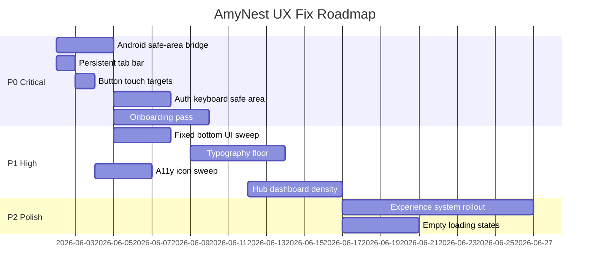

# AmyNest UI/UX Fix Plan

**Companion to:** `AUDIT_REPORT.md`  
**Ordering:** Return on Investment (impact ÷ effort)  
**Goal:** App Store Feature / Play Editorial / premium parenting product readiness

---

## ROI Framework

| Tier | Definition | Target timeline |
|------|------------|-----------------|
| **P0** | Blocks editorial review or causes daily user-visible breakage | Sprint 0 (1–2 weeks) |
| **P1** | High subconscious brand damage; moderate effort | Sprint 1–2 |
| **P2** | Polish; improves cohesion for power users | Sprint 3–4 |
| **P3** | Premium delight; optional before launch | Post-launch or parallel |

**Impact scale:** 🔴 Critical · 🟠 High · 🟡 Medium · 🟢 Low  
**Effort scale:** S (< 1 day) · M (1–3 days) · L (3–7 days) · XL (1–2 weeks)

---

## P0 — Critical Fixes (must fix before release)

### 1. Android Play safe-area inset bridge
| | |
|---|---|
| **ROI** | ⭐⭐⭐⭐⭐ Highest — fixes every screen on primary Android channel |
| **Impact** | 🔴 Critical |
| **Effort** | M |
| **Files** | `android/app/src/main/kotlin/com/amynest/app/MainActivity.kt`, `artifacts/kidschedule/src/index.css` |
| **Problem** | Immersive edge-to-edge + hidden system bars with **keyboard-only** inset injection. `--sab` stays 0; header/footer padding zeroed on `amynest-android-shell`. |
| **Fix** | Port inset bridge from `artifacts/kidschedule-android/` (or equivalent): inject `--sab`, `--app-bottom-clearance`, optional `--sat` via `evaluateJavascript` on inset changes. Align CSS to consume injected vars **and** `env()` fallback. |
| **Verify** | Pixel 8 + Samsung S24: dashboard tab bar, sign-in CTA, phonics bottom bar, social landing sticky CTA clear of gesture nav. |
| **Est. impact** | Eliminates #1 premium-killer on Android; +15–20 pts safe-area score. |

---

### 2. Persistent bottom navigation on tab-root routes
| | |
|---|---|
| **ROI** | ⭐⭐⭐⭐⭐ |
| **Impact** | 🔴 Critical |
| **Effort** | S |
| **Files** | `components/layout.tsx` (L158–173, L295), `index.css` (`.has-tabbar` / scroll padding) |
| **Problem** | `MobileTabBar visible={showDashboardChrome}` — tab bar **only on `/dashboard`**. Users lose primary nav on `/routines`, `/amy-coach`, `/parenting-hub`. |
| **Fix** | Change visibility to `TAB_ROOT_ROUTES.has(location)` or `showTabBar = isTabRootRoute(location)`. Update `has-tabbar` body class and scroll padding consistently. |
| **Verify** | Navigate dashboard → routines → parenting hub; tab bar persists; active state correct; back stack unchanged. |
| **Est. impact** | Restores platform-native navigation mental model; reduces support confusion. |

---

### 3. Default touch target elevation (Button primitive)
| | |
|---|---|
| **ROI** | ⭐⭐⭐⭐⭐ |
| **Impact** | 🔴 Critical (a11y + feel) |
| **Effort** | S |
| **Files** | `components/ui/button.tsx`, audit `size="icon"` call sites |
| **Problem** | Default 36px, sm 32px, icon 36×36 — below 44/48 guidelines app-wide. |
| **Fix** | Update variants: `default: min-h-11 min-w-[44px]`, `icon: h-11 w-11`, `sm: min-h-10` (40px compromise) or full 44px. Add `touch-target` utility for non-Button icon clicks. |
| **Verify** | Spot-check composer send, carousel arrows, routine week nav, toast close. |
| **Est. impact** | +25 pts touch target score; WCAG 2.5.5 compliance for primary controls. |

---

### 4. Auth flows — keyboard + safe area on Android WebView
| | |
|---|---|
| **ROI** | ⭐⭐⭐⭐ |
| **Impact** | 🔴 Critical |
| **Effort** | M |
| **Files** | `components/auth-keyboard-shell.tsx`, `hooks/use-native-auth-keyboard.ts`, `pages/sign-in.tsx`, `sign-up.tsx`, `reset-password.tsx`, `index.css` auth rules |
| **Problem** | `env(safe-area-inset-*)` unreliable in immersive WebView; Android auth scroll skips bottom safe padding. |
| **Fix** | Depend on injected `--sab` from P0-1; add `pb-[max(1rem,var(--sab))]` to auth scroll containers; ensure focused input scroll uses native inset vars. |
| **Verify** | Sign-in with keyboard open on Pixel + iPhone; CTA always tappable. |
| **Est. impact** | Fixes conversion funnel on Android; first authenticated impression. |

---

### 5. Onboarding first-impression pass
| | |
|---|---|
| **ROI** | ⭐⭐⭐⭐ |
| **Impact** | 🔴 Critical (editorial) |
| **Effort** | L |
| **Files** | `pages/onboarding.tsx`, related modals |
| **Problem** | Inline styles, emoji-as-icons, 0 aria-labels, inconsistent with premium learning surfaces. |
| **Fix** | (a) Replace inline `fontSize`/`color` with `TYPE` tokens; (b) add aria-labels to step controls; (c) unify card radius/shadows with `CARD_VARIANTS`; (d) safe-area on finishing overlay. |
| **Verify** | Lighthouse a11y on onboarding; editorial screenshot at 390px. |
| **Est. impact** | Directly affects App Store first-screenshot quality. |

---

## P1 — High Priority Fixes

### 6. Fixed bottom UI safe-area sweep
| | |
|---|---|
| **ROI** | ⭐⭐⭐⭐ |
| **Impact** | 🟠 High |
| **Effort** | M |
| **Files** | `social-landing.tsx`, `drawer.tsx`, `sheet.tsx`, `toast.tsx`, `paywall-modal.tsx`, `phonics.tsx`, `games.tsx`, `routines/detail.tsx`, `subscription-pricing-sticky-cta.tsx` (reference) |
| **Fix** | Apply pattern: `pb-[max(0.75rem,var(--sab,env(safe-area-inset-bottom)))]` to all fixed/sticky bottom elements; top insets on sticky headers. |
| **Est. impact** | Closes remaining edge-to-edge gaps after P0-1. |

---

### 7. Typography floor enforcement
| | |
|---|---|
| **ROI** | ⭐⭐⭐⭐ |
| **Impact** | 🟠 High |
| **Effort** | M (lint) + L (migration) |
| **Files** | App-wide; start with `mobile-tab-bar.tsx`, `parenting-hub.tsx`, `dashboard.tsx`, `landing.tsx` |
| **Fix** | (a) Add ESLint/style rule banning `text-[8px]`–`text-[11px]` in UI chrome; (b) migrate to `text-xs` (12px) minimum; (c) register typography scale in `@theme`. |
| **Est. impact** | Legibility on 320px; brand consistency. |

---

### 8. Color system consolidation
| | |
|---|---|
| **ROI** | ⭐⭐⭐ |
| **Impact** | 🟠 High |
| **Effort** | L |
| **Files** | `index.css`, feature files using raw palette |
| **Fix** | (a) Single body background; (b) deprecate `--bg-primary` hex block; (c) rename/clarify `--accent` vs `--accent-hsl`; (d) remove duplicate `.dark` block or implement real light mode. |
| **Est. impact** | Subconscious "one app" cohesion. |

---

### 9. Icon-only button accessibility sweep
| | |
|---|---|
| **ROI** | ⭐⭐⭐⭐ |
| **Impact** | 🟠 High |
| **Effort** | M |
| **Files** | `persistent-composer.tsx`, `routines/detail.tsx`, `recipes.tsx`, `event-prep.tsx`, `study.tsx`, `speech-coach/*`, `routines/index.tsx`, `parent-profile.tsx` |
| **Fix** | Add `aria-label` to every `size="icon"` and raw icon `<button>`. Fix `mobile-tab-bar.tsx` nav label → `t("nav.main")` or equivalent. |
| **Est. impact** | +10 pts accessibility; VoiceOver/TalkBack usability. |

---

### 10. ChatPlatform message padding on Android Play
| | |
|---|---|
| **ROI** | ⭐⭐⭐ |
| **Impact** | 🟠 High |
| **Effort** | S |
| **Files** | `components/chat-platform.tsx` |
| **Fix** | Include `var(--sab, env(safe-area-inset-bottom))` in messages area `paddingBottom` calculation. |
| **Est. impact** | Last messages not hidden behind gesture nav in assistant/onboarding chat. |

---

### 11. Hub + dashboard density reduction
| | |
|---|---|
| **ROI** | ⭐⭐⭐ |
| **Impact** | 🟠 High |
| **Effort** | L |
| **Files** | `pages/parenting-hub.tsx`, `pages/dashboard.tsx`, `components/family-executive-dashboard/` |
| **Fix** | Reduce tile count above fold; increase whitespace using `SCREEN_SPACING`; demote secondary widgets; consistent `CardTier` usage. |
| **Est. impact** | Premium calm vs clutter — editorial differentiator. |

---

### 12. Scroll padding modernization
| | |
|---|---|
| **ROI** | ⭐⭐⭐ |
| **Impact** | 🟠 High |
| **Effort** | S |
| **Files** | `index.css` — `.app-scroll`, `.main-content`, `.scroll-safe` |
| **Fix** | Replace `80px`/`120px` with `calc(var(--tabbar-height, 72px) + var(--sab, env(safe-area-inset-bottom)))`. |
| **Est. impact** | Content no longer clipped or over-padded across devices. |

---

## P2 — Polish Improvements

### 13. Adopt `experience-system.ts` globally
| | |
|---|---|
| **ROI** | ⭐⭐⭐ |
| **Impact** | 🟡 Medium |
| **Effort** | XL |
| **Files** | All `pages/*` — migrate incrementally by traffic |
| **Fix** | Wrap pages in `ScreenShell`; use `TYPE`, `SCREEN_SPACING`, `CARD_VARIANTS`, `EmptyStateCard`, `SKELETON_BASE`. |
| **Est. impact** | Learning-zone quality spreads app-wide. |

---

### 14. Unified empty and loading states
| | |
|---|---|
| **ROI** | ⭐⭐⭐ |
| **Impact** | 🟡 Medium |
| **Effort** | M |
| **Files** | `components/learning-progress/premium-polish.tsx`, `family-executive-dashboard/dashboard-states.tsx`, weak screens in audit Phase 9 |
| **Fix** | Export `EmptyStateCard` + skeleton patterns from learning-progress; replace plain "No X yet" text. |
| **Est. impact** | Reduces "unfinished app" perception during data load. |

---

### 15. Focus-visible policy
| | |
|---|---|
| **ROI** | ⭐⭐ |
| **Impact** | 🟡 Medium |
| **Effort** | M |
| **Files** | `amy-fab.tsx`, `ai-coach.tsx`, `onboarding-country-modal.tsx`, `ptm-prep.tsx` |
| **Fix** | Replace `focus:outline-none` with `focus-visible:ring-2 focus-visible:ring-primary`. |
| **Est. impact** | Keyboard navigation users; App Store accessibility narrative. |

---

### 16. shadcn vs product radius alignment
| | |
|---|---|
| **ROI** | ⭐⭐ |
| **Impact** | 🟡 Medium |
| **Effort** | M |
| **Files** | `components/ui/button.tsx`, `input.tsx`, `card.tsx` |
| **Fix** | Bump shadcn `--radius` usage to `rounded-xl`/`rounded-2xl` for form controls OR document intentional "sharp forms, soft content" split. |
| **Est. impact** | Forms feel belonging to same app as chat bubbles. |

---

### 17. Immersive route back affordance audit
| | |
|---|---|
| **ROI** | ⭐⭐⭐ |
| **Impact** | 🟡 Medium |
| **Effort** | M |
| **Files** | `speech-coach/*`, `phonics.tsx`, `study.tsx`, `audio-lessons.tsx`, `hub-module-page-shell.tsx` |
| **Fix** | Ensure every immersive screen has visible back control ≥44px with label; empty states get safe-top padding. |
| **Est. impact** | Eliminates "trapped" feeling in learning zones. |

---

### 18. Remove dead navigation/CSS artifacts
| | |
|---|---|
| **ROI** | ⭐⭐ |
| **Impact** | 🟢 Low |
| **Effort** | S |
| **Files** | `pages/not-found.tsx`, `index.css` `.header-safe`, `.inset-bottom-safe`, `kidschedule-android/` vs `android/` docs |
| **Fix** | Wire or remove unused code; document single Android owner path. |
| **Est. impact** | Prevents future fixes landing in wrong tree (recurrence of P0-1). |

---

## P3 — Premium UX Enhancements

### 19. Global page transitions
| | |
|---|---|
| **ROI** | ⭐⭐ |
| **Impact** | 🟢 Low (delight) |
| **Effort** | M |
| **Files** | `AppCore.tsx`, `experience-system.ts` `pageEnter` |
| **Fix** | Wrap route outlet in `AnimatePresence` + `pageEnter` variants; respect `performanceTier` to disable on low-end. |

---

### 20. Tablet content max-width
| | |
|---|---|
| **ROI** | ⭐⭐ |
| **Impact** | 🟢 Low |
| **Effort** | S |
| **Files** | Immersive pages, chat surfaces |
| **Fix** | `max-w-2xl mx-auto` on readable content in landscape iPad. |

---

### 21. Motion budget enforcement
| | |
|---|---|
| **ROI** | ⭐⭐ |
| **Impact** | 🟡 Medium (performance) |
| **Effort** | M |
| **Files** | `math-animation/*`, `abacus-zone.tsx`, `speech-coach/index.tsx` |
| **Fix** | Gate Framer Motion complexity via `visualBudget()`; reduce simultaneous animators on low tier. |

---

### 22. Image dimension stability
| | |
|---|---|
| **ROI** | ⭐ |
| **Impact** | 🟢 Low |
| **Effort** | S |
| **Files** | `landing.tsx`, `social-landing.tsx`, `store-tap.tsx` |
| **Fix** | Explicit `width`/`height` or aspect-ratio containers on hero images. |

---

### 23. Editorial onboarding moments
| | |
|---|---|
| **ROI** | ⭐⭐ |
| **Impact** | 🟡 Medium (marketing) |
| **Effort** | L |
| **Files** | `onboarding.tsx`, `spotlight-tour.tsx` |
| **Fix** | Design 2–3 screenshot-ready beats: child profile, first Amy chat, routine reveal — aligned with App Store feature narrative. |

---

## Implementation Roadmap

---

## Quick Wins (< 1 day each, do first)

| # | Fix | File | ROI |
|---|-----|------|-----|
| QW-1 | Tab bar on all tab roots | `layout.tsx` | ⭐⭐⭐⭐⭐ |
| QW-2 | Tab bar `aria-label` fix | `mobile-tab-bar.tsx` | ⭐⭐⭐⭐ |
| QW-3 | Composer send `aria-label` + 44px | `persistent-composer.tsx` | ⭐⭐⭐⭐ |
| QW-4 | Back button 44px | `layout.tsx` L202 | ⭐⭐⭐ |
| QW-5 | Chat messages `--sab` padding | `chat-platform.tsx` | ⭐⭐⭐ |
| QW-6 | Rename/fix `.inset-bottom-safe` | `index.css` | ⭐⭐⭐ |

---

## Verification Gates (run before release)

| Gate | Command / action |
|------|------------------|
| Chat keyboard ownership | `pnpm run check:chat-platform` |
| Device safe-area | Manual matrix: iPhone 15 Pro, SE, Pixel 8, Galaxy S24, iPad |
| Accessibility | axe on onboarding, dashboard, routines detail, assistant |
| Touch targets | Spot audit 20 icon buttons post-Button fix |
| Navigation | Playwright stress routes: `playwright/specs/app-stress.spec.ts` |
| Typography | Lint rule: no `text-[8-11px]` in new code |
| Android inset | Log `--sab` in WebView on Pixel after MainActivity fix |

---

## Effort Summary

| Tier | Items | Est. effort | Est. score lift |
|------|-------|-------------|-----------------|
| P0 | 5 | ~2 weeks | +25 overall |
| P1 | 7 | ~2 weeks | +15 overall |
| P2 | 6 | ~3 weeks | +10 overall |
| P3 | 5 | ~2 weeks | +5 overall |
| **Total** | **23** | **~9 weeks sequential** | **55 → ~85 target** |

**Parallelization:** P0-1 (Android native) and P0-2/P0-3 (web) can run concurrently. P1 typography lint can start while P0 onboarding is in progress.

---

## What NOT to change (architecture freeze)

Per workspace rules, do **not** refactor during UX polish:

- **ChatPlatform** keyboard/viewport ownership — extend, don't duplicate
- **Speech Coach** audio/mic/dialogue engines — UI-only changes above engine
- **Capacitor iOS** StatusBar overlay strategy — already correct; don't inject `--vv-height` for chat on Android native

---

*End of fix plan. See `AUDIT_REPORT.md` for full findings and screen inventory.*
