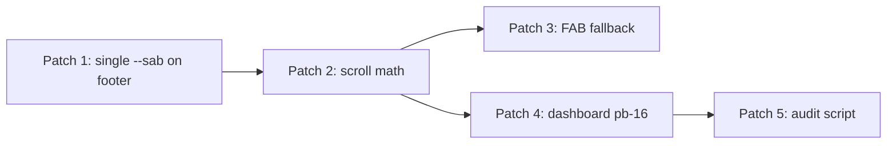

# Minimal Patch Plan — UX Stabilization Visual Regression

**Goal:** Restore original premium dashboard layout while **keeping** all Android 15 edge-to-edge, inset bridge, accessibility, and 44px touch targets.

**Rules:** No redesigns · No architecture changes · No reverting safe-area bridge · Surgical CSS/token alignment only.

**Estimated effort:** ~2–4 hours · **Risk:** Low · **Files touched:** 3–4

---

## Patch Strategy (single principle)

> **One owner per inset axis.**  
> `--sab` extends the footer box once. Scroll padding equals **visual tab height + FAB overhang + `--sab`**. No duplicate `safe-area-*` utilities on nested tab bar children.

Introduce two CSS variables in `:root`:

```css
:root {
  --tabbar-visual-height: 72px;   /* unchanged design */
  --fab-overhang: 8px;            /* restores pre-80px fudge */
  --tabbar-total-height: calc(var(--tabbar-visual-height) + var(--sab, env(safe-area-inset-bottom, 0px)));
}
```

Alias existing `--tabbar-height` → `--tabbar-visual-height` (or repoint `--tabbar-height` to visual 72px and use `--tabbar-total-height` for layout math).

---

## Patch 1 — Remove double safe-area on tab bar

| | |
|---|---|
| **Priority** | P0 |
| **Confidence** | High |
| **Fixes** | S3 tab bar feels larger, S5 visible safe-area band, partial S1 |

### Changes

**`artifacts/kidschedule/src/components/mobile-tab-bar.tsx` ~L47**

```diff
- <div className="relative flex min-h-[var(--tabbar-height,72px)] w-full items-end justify-around px-2 pb-2 safe-area-bottom">
+ <div className="relative flex h-[72px] w-full items-end justify-around px-2 pb-2">
```

**`artifacts/kidschedule/src/index.css` ~L910–925**

```diff
 .app-footer {
   ...
-  min-height: var(--tabbar-height, 72px);
+  min-height: var(--tabbar-visual-height, 72px);
   padding-bottom: var(--sab, env(safe-area-inset-bottom, 0px));
 }
 .app-footer__nav {
-  min-height: 72px;
+  min-height: var(--tabbar-visual-height, 72px);
 }
```

Keep `--sab` **only** on `.app-footer` (one application). Do **not** add `safe-area-bottom` inside footer.

### Verify

- Footer visual row = 72px on web and device
- Gesture inset absorbed below labels, no empty band above labels

---

## Patch 2 — Align scroll padding with tab + FAB + safe area

| | |
|---|---|
| **Priority** | P0 |
| **Confidence** | High |
| **Fixes** | S1 content behind tab bar, S2 FAB overlap |

### Changes

**`artifacts/kidschedule/src/index.css` ~L633–638**

```diff
 body.has-tabbar .app-scroll,
 body.has-tabbar .page-content,
 body.has-tabbar .main-content {
   padding-bottom: calc(
-    var(--tabbar-height, 72px) + var(--sab, env(safe-area-inset-bottom, 0px))
+    var(--tabbar-total-height, calc(72px + var(--sab, env(safe-area-inset-bottom, 0px))))
+    + var(--fab-overhang, 8px)
   );
 }
```

This restores the pre-stabilization **80px** intent on web (`72 + 8`) while adding `--sab` on Android.

**Non-tab pages** — keep `1rem + --sab` (unchanged).

### Verify

- Dashboard last widget clears tab bar and FAB on 390px and 320px
- Android: content clears gesture nav (via `--sab` in `--tabbar-total-height`)

---

## Patch 3 — Fix non-embedded FAB fallback offset

| | |
|---|---|
| **Priority** | P1 |
| **Confidence** | High |
| **Fixes** | S2 on routes without embedded footer FAB |

### Changes

**`artifacts/kidschedule/src/index.css` ~L954–963**

```diff
 #amy-fab-floating:not(.amy-fab-in-footer) {
   ...
-  bottom: calc(72px + 8px) !important;
+  bottom: calc(var(--tabbar-total-height, 72px) + var(--fab-overhang, 8px)) !important;
 }
```

Embedded FAB rule (`bottom: calc(100% + 8px)`) — **no change**.

### Verify

- Stack screens with tab bar hidden: FAB sits above system nav
- Tab-root screens: embedded FAB unchanged

---

## Patch 4 — Remove dashboard redundant bottom padding

| | |
|---|---|
| **Priority** | P0 |
| **Confidence** | High |
| **Fixes** | S4 less first viewport (scroll end dead zone), excess blank above tab bar |

### Changes

**`artifacts/kidschedule/src/pages/dashboard.tsx` ~L1374, L1396**

```diff
- <div ... className={`dashboard-page ... ${SCREEN_SPACING.pageBottom}`}>
+ <div ... className="dashboard-page w-full min-w-0 max-w-full bg-[#0a1024]">
```

Keep inner `pb-6 md:pb-8` for desktop breathing room only, or reduce to `pb-4 md:pb-8`.

**Do not** remove `SCREEN_SPACING` from parenting hub in this patch (separate pass if needed).

### Verify

- Scroll to bottom: no 64px empty slab above tab bar
- First viewport shows same or more content vs patched state

---

## Patch 5 — Update regression gate (optional, recommended)

| | |
|---|---|
| **Priority** | P2 |
| **Confidence** | Medium |

### Changes

**`scripts/ux-stabilization-audit.ts`**

Add assertion that `mobile-tab-bar.tsx` does **not** contain `safe-area-bottom`.

Add assertion that `body.has-tabbar` scroll rule includes `fab-overhang`.

### Verify

```bash
pnpm run check:ux-stabilization
```

---

## Explicit non-changes (do NOT touch)

| Item | Reason |
|------|--------|
| `MainActivity.kt` inset injection | Android 15 compliance |
| `setDecorFitsSystemWindows(false)` | Edge-to-edge |
| Immersive system bars | Gesture nav |
| Android header `--sat` | Status bar clearance |
| iOS Capacitor header rules | User requirement: iOS unchanged |
| `isTabRootRoute` tab visibility | Navigation improvement |
| `components/ui/button.tsx` 44px | Accessibility |
| aria-label sweep | Accessibility |
| `chat-platform.tsx` `--sab` messages padding | Unrelated; correct |

---

## Implementation order



1. Patch 1 (eliminates double inset — unblocks accurate height)
2. Patch 2 (scroll clearance — fixes overlap)
3. Patch 4 (remove dead zone — can parallel with 2)
4. Patch 3 (edge routes)
5. Patch 5 (prevent recurrence)

---

## Test matrix (required before merge)

| Surface | 320px | 390px | Android Play | iOS Capacitor | Tablet |
|---------|-------|-------|--------------|-------------|--------|
| `/dashboard` | ✓ | ✓ | ✓ | ✓ no header change | ✓ |
| `/routines` | ✓ | ✓ | ✓ | ✓ | ✓ |
| `/parenting-hub` | ✓ | ✓ | ✓ | ✓ | ✓ |
| `/assistant` | N/A tab | ✓ chat | ✓ | ✓ | ✓ |

### Pass criteria

1. Last dashboard card fully above tab bar + FAB  
2. No visible double inset band on tab bar  
3. Tab nav row measures ~72px (excluding system inset below)  
4. `--sab` non-zero on Android DevTools; zero on desktop web  
5. `pnpm run check:ux-stabilization` green  

---

## ROI summary

| Patch | Effort | Impact |
|-------|--------|--------|
| 1 — single `--sab` on footer | 15 min | Fixes visible band + bar height |
| 2 — scroll math + FAB overhang | 15 min | Fixes overlap (primary user pain) |
| 4 — remove dashboard `pb-16` | 5 min | Fixes dead zone + viewport |
| 3 — FAB fallback | 5 min | Edge routes |
| 5 — audit gate | 15 min | Prevents recurrence |

**Total:** ~1 hour code + ~1 hour device QA

---

*Ready for surgical implementation. No stabilization features reverted.*
