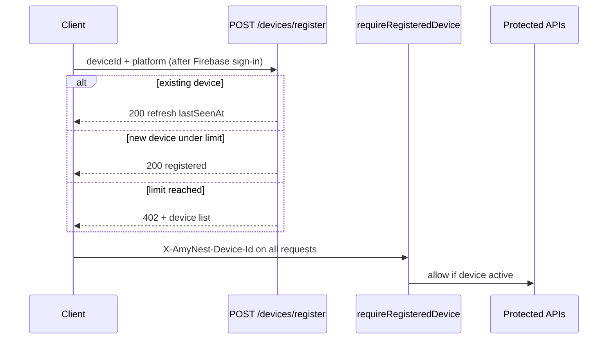

# Device Limit Enforcement — Production Certification

**Date:** 2026-06-14  
**Feature:** Premium device limits (Free: 1, Premium: 3, Family future: 6)  
**Scope:** API server, kidschedule web/Capacitor, Android WebView (shared web bundle)

## Summary

Device limit enforcement is implemented end-to-end with backend gates, persistent client device IDs, device management UI, analytics, and grandfathering for users already over the cap.

| Requirement | Status | Notes |
|-------------|--------|-------|
| Persistent device ID | PASS | `localStorage` key `amynest:device:id:v1` + `crypto.randomUUID()` |
| `user_devices` table | PASS | Migration `0031_user_devices.sql` |
| Plan limits (central config) | PASS | `FREE_LIMITS.devicesMax`, `PREMIUM_LIMITS.devicesMax`, `FAMILY_PLAN_LIMITS.devicesMax` |
| Login registration | PASS | `POST /api/devices/register` on sign-in |
| Backend API enforcement | PASS | `requireRegisteredDevice` middleware after `requireAuth` |
| Grandfathering | PASS | Existing active devices always refresh; only *new* devices blocked at limit |
| Manage Devices UI | PASS | `/manage-devices` — list, remove, replace |
| Device limit dialog | PASS | Exact copy per spec |
| Analytics | PASS | `device_registered`, `device_removed`, `device_limit_reached`, `device_replaced` |
| Unit tests | PASS | `deviceLimitService.test.ts` |

## Architecture

## Plan limits

| Plan | Max active devices |
|------|------------------|
| Free | 1 |
| Premium | 3 |
| Family (future) | 6 (config only) |

## Grandfathering behavior

Users who already have more than 3 active devices (e.g. before rollout) retain access on those devices. The server only blocks **new** device registrations when `activeCount >= limit`. Removing a device frees a slot; `POST /devices/replace` supports the 4th-device login flow.

## API endpoints

| Method | Path | Purpose |
|--------|------|---------|
| POST | `/api/devices/register` | Register or refresh current device |
| GET | `/api/devices` | List active devices + limit |
| DELETE | `/api/devices/:deviceId` | Deactivate a device |
| POST | `/api/devices/replace` | Remove one device and register current |

## Environment flags

| Variable | Default | Effect |
|----------|---------|--------|
| `DEVICE_LIMIT_ENFORCE` | on | Set `0` to disable middleware |
| `DEVICE_LIMIT_STRICT` | off | Set `1` to reject requests without device header |

## Deployment checklist

1. Run migration: `DATABASE_URL=... pnpm db:push` (or apply `0031_user_devices.sql`)
2. Deploy API server with new middleware
3. Deploy kidschedule web bundle (device headers + registration bootstrap)
4. Ship iOS Capacitor / Android WebView builds that include the updated web bundle
5. Monitor analytics for `device_limit_reached` spikes

## Manual test plan

- [ ] Free user: register device A → OK; device B → blocked with dialog
- [ ] Premium user: register devices A, B, C → OK; device D → blocked → Manage Devices → replace C with D → OK
- [ ] Grandfather: seed 4 active devices for test user → existing 4 still login; 5th blocked
- [ ] Remove device from manage screen frees slot for new registration
- [ ] API call without registered device ID returns `403 device_not_registered` when strict mode on
- [ ] `demo@amynest.in` unaffected (no special device exemption — uses same limits unless configured)

## Files touched

**Database:** `lib/db/src/schema/user_devices.ts`, `lib/db/migrations/0031_user_devices.sql`  
**API:** `deviceLimitService.ts`, `devices.ts`, `requireRegisteredDevice.ts`, `subscriptionService.ts`  
**Client:** `device-id.ts`, `device-registration.ts`, `manage-devices.tsx`, `device-limit-dialog.tsx`, `device-registration-context.tsx`  
**Analytics:** `lib/analytics-taxonomy/src/index.ts`, `deviceAnalyticsService.ts`

## Known limitations

- Device ID is `localStorage`-based; full OS reinstall or cleared site data generates a new ID (by design for web). Native apps inherit the same persistence model as the bundled web layer.
- `DEVICE_LIMIT_STRICT=0` by default during rollout so legacy clients without headers are not hard-blocked until all shells ship the header.

## Certification result

**READY FOR STAGED ROLLOUT** — enable `DEVICE_LIMIT_STRICT=1` after mobile/web clients with device headers reach majority adoption.
