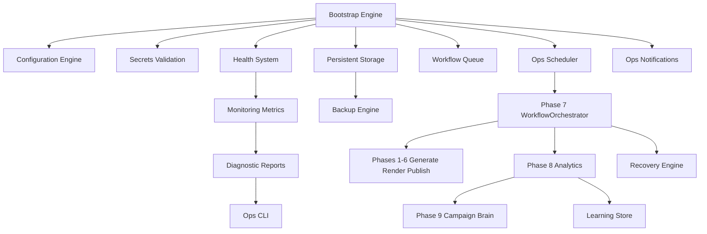

# Architecture Diagram

```mermaid
flowchart TD
  bootstrap[Bootstrap Engine] --> config[Configuration Engine]
  bootstrap --> secrets[Secrets Validation]
  bootstrap --> health[Health System]
  bootstrap --> storage[Persistent Storage]
  bootstrap --> queue[Workflow Queue]
  bootstrap --> scheduler[Ops Scheduler]

  scheduler --> workflow[Phase 7 WorkflowOrchestrator]
  workflow --> phases[Phases 1-6 Generate Render Publish]
  workflow --> analytics[Phase 8 Analytics]
  analytics --> brain[Phase 9 Campaign Brain]
  analytics --> learning[Learning Store]

  workflow --> recovery[Recovery Engine]
  storage --> backup[Backup Engine]
  health --> monitoring[Monitoring Metrics]
  bootstrap --> notifications[Ops Notifications]
  monitoring --> diagnostics[Diagnostic Reports]
  diagnostics --> cli[Ops CLI]
```

Phases 1–9 remain unchanged. Phase 10 wraps them with production bootstrap, observability, recovery, and deployment tooling.
