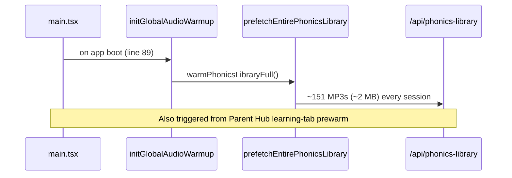
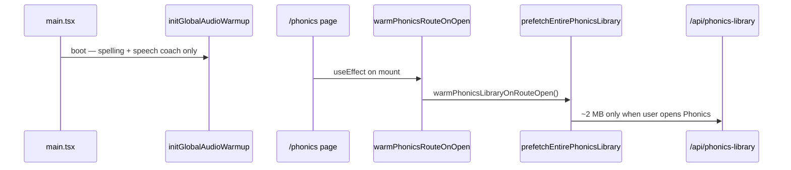

# Phonics prefetch — before / after

## Before

## After

**Code:** `warmPhonicsLibraryOnRouteOpen()` in `global-audio-warmup.ts`; called from `warmPhonicsRouteOnOpen()` in `app-audio-prefetch.ts` when `phonics.tsx` mounts.
