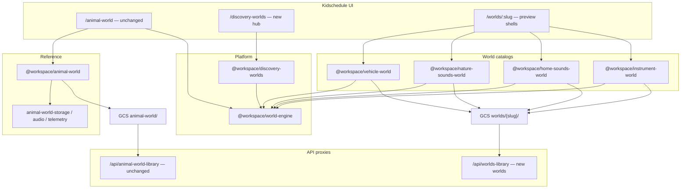

# Discovery Worlds Platform — Architecture

## Principle

**Animal World is the reference implementation.** Phase-2 behavior (audio manager, storage keys, analytics events, routes, UI) stays intact. The platform layer adds shared contracts and new worlds without replacing Animal World code paths.

## Layer diagram



## World Engine (`@workspace/world-engine`)

| Module | Responsibility |
|--------|----------------|
| `world-engine.ts` | Catalog index, neighbors, analytics payload helper |
| `manifest-types.ts` | Shared `manifest.json` item shape |
| `gcs-layout.ts` | Path rules; Animal legacy `animal-world/` documented |
| `standard-modes.ts` | Explore, Toddler, Quiz, Hear & Find, Discovery, Stars, Stickers, Parent |
| `hear-find.ts` | Generic hear-and-find question builder |
| `discovery.ts` | Slideshow phase sequence |
| `progress-types.ts` | Per-world v2 progress (parallel storage keys) |
| `reward-system.ts` | XP + Bronze / Silver / Gold |
| `achievement-engine.ts` | Cross-world achievement definitions |
| `sticker-engine.ts` | Sticker catalog + unlock rules |
| `offline-cache.ts` | Top-N manifest for Cache API |
| `parent-insights.ts` | Parent dashboard aggregates |
| `registry.ts` | Five worlds: routes, gates, GCS folders, status |

## Animal World bridge (`@workspace/discovery-worlds`)

Read-only adapter: `Animal` → `WorldManifestItem` for hub and future parent cross-world views. **Does not** change Animal World runtime or localStorage keys.

## GCS asset layout

| World | Prefix (bucket root) | Manifest |
|-------|----------------------|----------|
| Animal World (legacy) | `animal-world/` | `animal-world/animals.json` |
| Vehicles | `worlds/vehicles/` | `worlds/vehicles/manifest.json` |
| Nature | `worlds/nature/` | `worlds/nature/manifest.json` |
| Home | `worlds/home/` | `worlds/home/manifest.json` |
| Instruments | `worlds/instruments/` | `worlds/instruments/manifest.json` |

Per item:

```
{prefix}/{category}/{itemId}/
  hero.webp
  hero-real.webp      # optional
  hero-cartoon.webp   # optional
  narration-intro.mp3
  narration-sound.mp3
  {sound-id}.mp3
```

**No runtime TTS.** All audio is pre-generated MP3 in GCS.

## Storage (backward compatible)

| Data | Key pattern | Owner |
|------|-------------|--------|
| Animal stats v1 | `amynest:animal-world:stats:v1` | Animal World (unchanged) |
| Animal progress v2 | `amynest:animal-world:progress:v2` | Animal World (unchanged) |
| Other worlds progress | `amynest:discovery-worlds:progress:v2:{worldId}:{childId}` | Platform |
| Offline cache meta | `amynest:discovery-worlds:offline:v1:{worldId}:{childId}` | Platform |

## Analytics

- **Animal World:** existing `animal_world:*` client logs (unchanged).
- **New worlds:** `discovery_worlds:{worldId}:{event}` via `trackDiscoveryWorldsEvent`.

## Rollout status

| World | UI route | Status |
|-------|----------|--------|
| Animal World | `/animal-world` | **live** (reference) |
| Vehicle World | `/worlds/vehicles` | preview manifest |
| Nature Sounds | `/worlds/nature` | preview manifest |
| Home Sounds | `/worlds/home` | preview manifest |
| Instrument World | `/worlds/instruments` | preview manifest |

Full mode UI for non-animal worlds reuses the same engine modules when each world graduates from `preview` → `live` (clone Animal World shell with world-specific catalog injection — no Animal World file moves).

## Scale

- Virtualized grids (Animal World `VirtualizedGrid`) remain per-world UI.
- Catalog maps built once per package (`Map` by id).
- Offline manifest caps: 50 items / 200 sounds / 80 images per world.
- Audio: existing `AnimalAudioManager` pattern; new worlds get parallel managers in a later increment (no change to Animal manager in this step).

## Related docs

- [animal-world-phase2-migration.md](./animal-world-phase2-migration.md) — Animal-specific Phase 2
- [discovery-worlds-migration-from-animal-world.md](./discovery-worlds-migration-from-animal-world.md) — Platform migration steps
