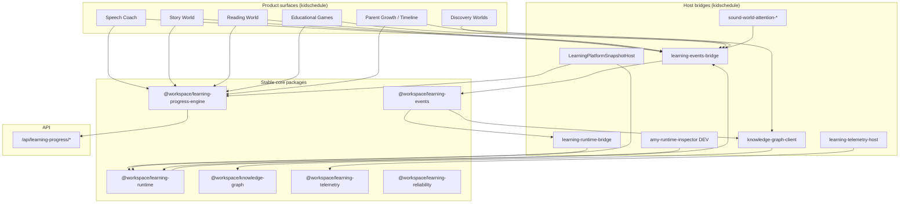
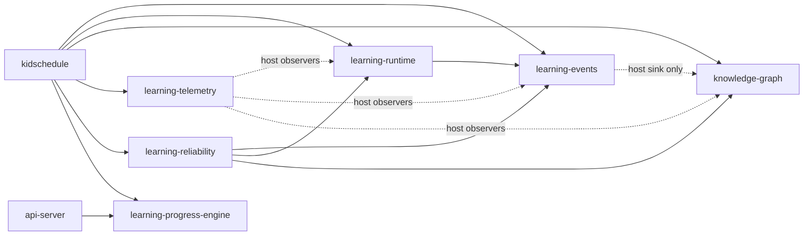

# Architecture Specification v1.0

## 1. Purpose

Unify learning signals across AmyNest product surfaces so that:

- **Consumers** present experiences (speech, stories, reading, games, discovery)
- **Learning Runtime** decides difficulty, hints, celebration, review, recommendations
- **Knowledge Graph** stores concept evidence
- **Learning Events** is the shared bus
- **Learning Progress Engine** owns durable hub progression (XP, unlocks, skill graph persistence)

## 2. System context diagram



## 3. Dependency graph (packages)



**Acyclic rule (host):** Events → (KG sink, Runtime) → decisions → consumers.  
`knowledge.updated` is fan-out with `busOrigin` to prevent KG write loops.

## 4. Package ownership matrix

| Concern | Owner | Must not own |
|---------|-------|--------------|
| Event schema & bus | `learning-events` | UI, mastery math |
| Decisions (difficulty, hints, review, recs) | `learning-runtime` | Story text, game physics |
| Concept nodes / observations / recommend | `knowledge-graph` | Session UX |
| XP, unlocks, skill graph persist, hub rewards | `learning-progress-engine` | World narrative engines |
| Counters / alerts / health | `learning-telemetry` | Product UX |
| Chaos / verify / heal | `learning-reliability` | Production UI |
| Attention heuristics | kidschedule attention store | Clinical diagnosis |
| Storytelling / video | Story Hub | Mastery / difficulty engines |
| Phonics lesson UI | Reading / PhonicsV2 | Adaptive progression engines |
| Gameplay / physics | Games Hub | Recommendation engines |
| World catalogs | discovery / animal world packages | Learning decision logic |

## 5. Layering

```
Presentation (consumers)
    ↓ publish events / apply guidance
Host bridges (kidschedule)
    ↓
Core packages (Stable)
    ↓
Persistence: LPE via API; KG localStorage; events offline queue
```

## 6. Authority split (critical)

| Decision type | Authority |
|---------------|-----------|
| Next activity difficulty / hints / celebration for LP consumers | **Learning Runtime** |
| Concept confidence / forgotten / weak phonemes | **Knowledge Graph** |
| Hub XP, coins, unlocks, skill graph levels | **Learning Progress Engine** |
| Curriculum safety (SATPIN letter groups, age game caps) | **Consumer content rules** (not Runtime) |

See ADR-0003 and ADR-0004.
