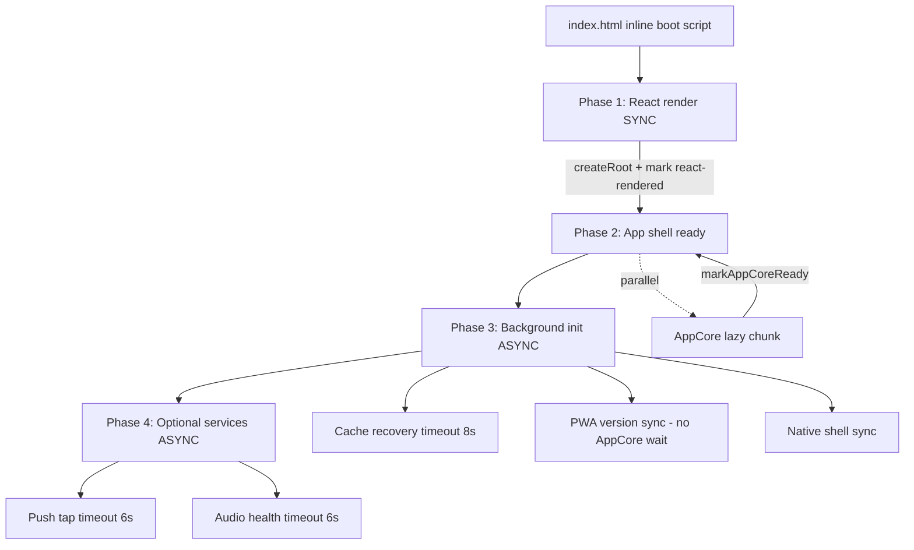

# AmyNest Startup Architecture (Permanent)

## 1. Root cause analysis

**Incident:** Production `boot-timeout` on `https://www.amynest.in/pricing` after deploy `41551424`.

**Mechanism:**

```
main.bootstrap() [async]
  └─ await syncPwaCacheAndVersion()
       └─ deploy version mismatch
            └─ await waitForAppCoreReady()  // up to 20s
                 └─ AppCore cannot load — blocked on bootstrap
                      └─ react-rendered never marked
                           └─ index.html watchdog @ 14s → boot-timeout
```

**Class of failure:** Pre-render bootstrap awaited a post-render resource (AppCore), creating a **circular startup dependency**.

**Not caused by:** Pricing UI, RevenueCat paywall copy, or monthly-equivalent math (those load in lazy chunks after mount).

---

## 2. New startup architecture



### Rules enforced

| Rule | Implementation |
|------|----------------|
| React first | `main.tsx` `bootstrap()` is sync; only `createRoot().render()` before any `await` |
| Isolated phases | `startup-orchestrator.ts` phase machine + `startup-background.ts` |
| All waits timeout | `waitWithTimeout()` default 8s (AppCore wait 25s, only after react) |
| PWA never waits AppCore | `runPwaCacheSyncBackground()` — clear caches → reload |
| Deadlock detection | `registerStartupWait()` + forbidden `bootstrap → app_core` edges |
| Diagnostics | `window.__amynestStartupState`, `/?diag=1` timeline |
| Watchdog | Progress-aware: extends once if `bundle-loaded` or recent `lastProgressAt` |

---

## 3. Files changed

| File | Role |
|------|------|
| `src/lib/startup-orchestrator.ts` | Phase machine, timeouts, deadlock, telemetry, `__amynestStartupState` |
| `src/lib/startup-background.ts` | Phase 3 + 4 tasks (fire-and-forget) |
| `src/lib/pwa-cache-sync.ts` | Background-only deploy sync; no AppCore wait |
| `src/main.tsx` | Phase 1 sync mount; schedule background |
| `src/App.tsx` | Phase 2 `markAppShellReady()` |
| `src/AppCore.tsx` | `markAppCoreReady()` (splash only) |
| `index.html` | Progress-aware boot watchdog + diag startup timeline |
| `src/lib/startup-orchestrator.test.ts` | Regression tests |
| `src/lib/deploy-version.ts` | Single deploy version source (`amynest-deploy` + sessionStorage) |
| `src/lib/startup-api-guard.ts` | Blocks deprecated `syncPwaCacheAndVersion` before `reactRendered` |
| `src/lib/startup-telemetry-beacon.ts` | Anonymous `POST /api/startup-events` (pre-auth) |
| `src/lib/boot-watchdog.ts` + `public/boot-watchdog.js` | Pure watchdog decision logic (TS + ES5 sync) |
| `playwright/specs/startup-reliability.spec.ts` | Degraded-path E2E (React + no boot-timeout) |
| `docs/startup-architecture.md` | This document |

---

## 4. Dependency graph

```
Phase 1 (sync)
  main.tsx → App.tsx → [Suspense] → AppCore (lazy)

Phase 3 (async, after react_rendered)
  startup-background
    ├─ runPwaCacheSyncBackground  (no → AppCore)
    ├─ runBootCacheRecoveryIfNeeded
    ├─ initNativeShell (sync)
    └─ service worker probe

Phase 4 (async)
  ├─ initCapacitorPushTapHandling
  └─ checkStaticAudioHealthOnBoot

FORBIDDEN EDGES (deadlock):
  bootstrap:pre_render → app_core
  phase1:react_mount → app_core
```

---

## 5. Deadlock prevention strategy

1. **Single rule:** Nothing in Phase 1 may `await` Phase 2+ resources.
2. **`registerStartupWait(waiter, waitingFor)`** builds a wait graph; cycles and forbidden edges emit `startup_deadlock_detected`.
3. **`waitForAppCoreReady()`** returns `false` immediately if `reactRendered !== true`.
4. **PWA deploy reload** runs only in Phase 3; never registers `bootstrap → app_core`.

---

## 6. Test coverage

`startup-orchestrator.test.ts`:

| # | Scenario | Assertion |
|---|----------|-----------|
| 1 | Stale cache version | `checkDeployVersionMismatch()` sync detect |
| 2 | SW / cache (timeout path) | `waitWithTimeout` fallback |
| 3 | Cache clear failure | fallback via timeout |
| 4 | AppCore timeout | `waitForAppCoreReady` false + no pre-render wait |
| 5–6 | RC / analytics | covered by generic `waitWithTimeout` pattern in background |
| 7 | Offline | Phase 1 has no network |
| 8 | Slow network | watchdog extension when `bundle-loaded` |
| 9 | First install | no mismatch |
| 10 | Upgrade install | mismatch without AppCore wait |

Run: `pnpm --filter @workspace/kidschedule test src/lib/startup-orchestrator.test.ts`

---

## 7. Rollout plan

1. Deploy to staging → verify `window.__amynestStartupState.phase` reaches `ready` on `/pricing`.
2. Simulate deploy bump (change `amynest:deploy-version` in sessionStorage) → confirm reload without 14s timeout.
3. Production canary → monitor `startup_deadlock_detected`, `boot_timeout`, `startup_timeout` in `/api/logs`.
4. Full rollout after 24h clean metrics.

---

## 8. Production validation checklist

- [ ] `/?diag=1` shows STARTUP TIMELINE after normal load
- [ ] `/pricing` loads without boot-timeout after deploy
- [ ] `__amynestStartupState.reactRendered === true` within 2s on 4G
- [ ] Deploy version change triggers reload, not hang
- [ ] Offline: shell renders; background tasks may fail silently
- [ ] No `startup_deadlock_detected` in logs for 48h
- [ ] Watchdog does not fire when `bundle-loaded` + slow AppCore (≤30s total)

---

## Observability events

| Event | When |
|-------|------|
| `startup_phase_entered` | Phase transition |
| `startup_phase_completed` | Phase done |
| `startup_timeout` | `waitWithTimeout` fired |
| `startup_deadlock_detected` | Circular / forbidden wait |
| `startup_recovery_used` | Deploy reload / cache recovery |
| `boot_timeout` | Phase 1 mount failure only |

Payload includes: `app_version`, `previous_version`, `platform`, `browser`, `route`.

Delivery: `trackStartupEvent()` → `postStartupBeacon()` (`POST /api/startup-events`, no auth) + `queueClientLog` when session exists.

---

## 9. Deploy version consolidation (reliability hardening)

| Before | After |
|--------|-------|
| `app_build_version` (localStorage) + inline `localStorage.clear()` | Removed |
| `amynest:deploy-version` (sessionStorage) + inline script | `deploy-version.ts` + `migrateLegacyDeployVersionStorage()` |
| Duplicate meta keys | `vite.config.ts` injects same value into `amynest-deploy` (and legacy meta if present) |

**Migration:** On first boot after upgrade, legacy `app_build_version` is copied to session key once, then deleted from localStorage. No full storage wipe.

**Backward compatibility:** Users with only legacy key get one-time migration; fresh installs use session key only.

---

## 10. Deprecated API guard

`syncPwaCacheAndVersion()` remains exported for compatibility but:

- Throws in `import.meta.env.DEV` if `!getStartupState().reactRendered`
- Production: telemetry `deprecated_startup_api_blocked` + no-op
- Correct path: `schedulePostRenderStartup()` → `runPwaCacheSyncBackground()`
